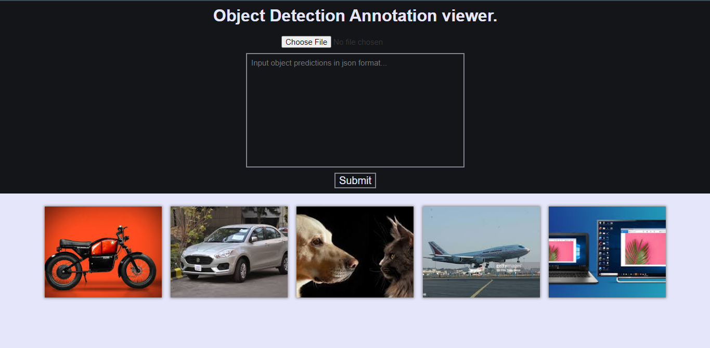
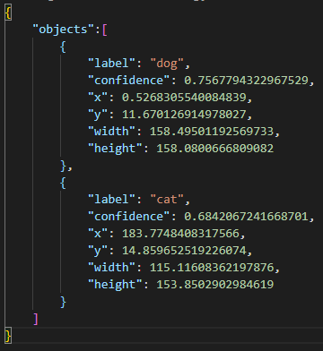
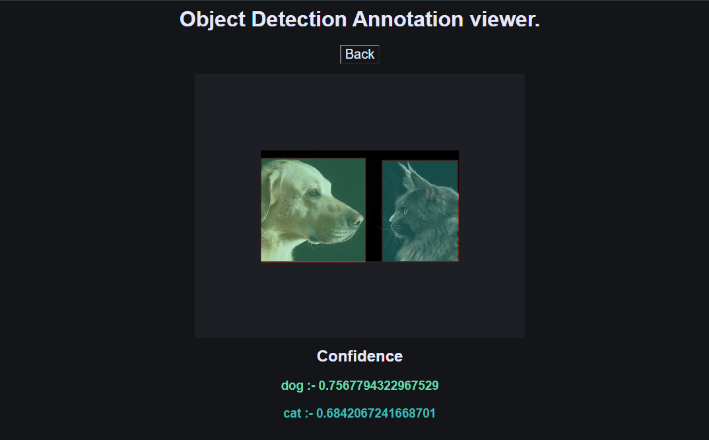

# Object Detection Annotation Viewer.
A Image viewer to mark and highlight objects in image based on coco json data built using vanilla javascript and paper js.
## [`Object Detection Annotation Viewer Demo`](https://devilzer.github.io/Object-Detection-Annotation-viewer/)
<h2> Features </h2>
<ul>
  <li>Image and Json input.</li>
  <li>Objects bounding box.</li>
  <li>Object lable and confidence info.</li>
  <li>Color coded objects.</li>
</ul>
<h2>Homepage</h2>

<h3>JSON input format</h3>

<h2>Details page</h2>

## Directory Structure

`/` Contains all html files. 
`/assets` Contains config files for js libries used in project. 
`/scripts` Contains javascript files used. 
`/styles` Contains all CSS files. 
`/test` Contains images and json file to test the app. 
